# 🧩 Decentralized MCP Registry - Use Cases

## 🤖 AI Agent Use Cases

### UC-A1: Tool Discovery

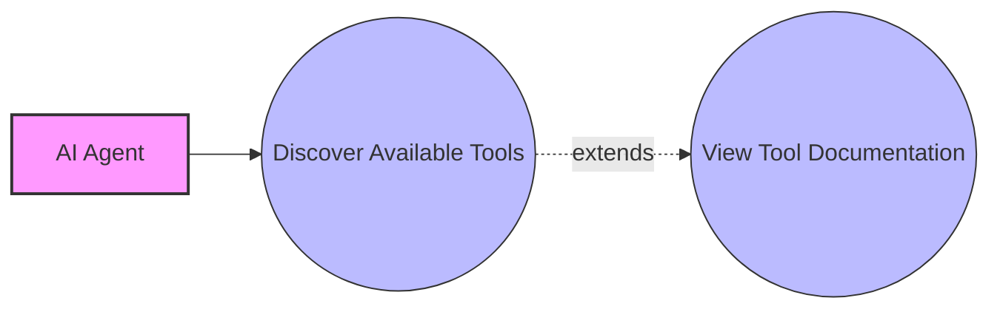

**Actor**: AI Agent  
**Goal**: Discover available tools across the network  
**Flow**:
1. Agent connects to a local registry node
2. Agent requests a list of available tools with their capabilities
3. Registry node aggregates tool information from local and connected remote nodes
4. Registry returns a unified list of tools with metadata and access information
5. Agent receives comprehensive tool catalog for potential use

### UC-A2: Tool Invocation

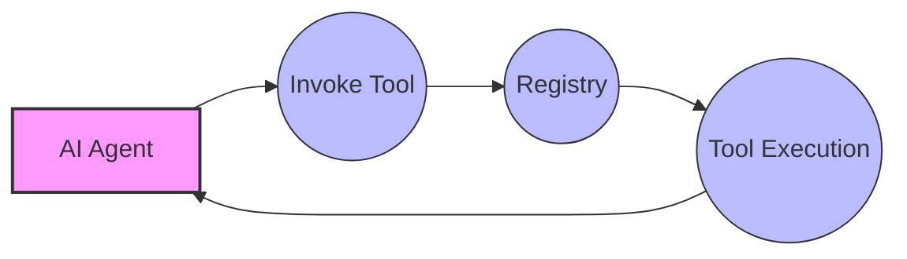

**Actor**: AI Agent  
**Goal**: Execute a specific tool functionality  
**Flow**:
1. Agent selects a tool from the previously discovered catalog
2. Agent constructs a valid invocation request according to the tool's interface
3. Agent sends the invocation request to the local registry node
4. Registry determines if the tool is local or remote
5. Registry routes the request to the appropriate node
6. Tool executes and returns results through the registry chain
7. Agent receives results transparently

### UC-A3: Tool Search by Capability

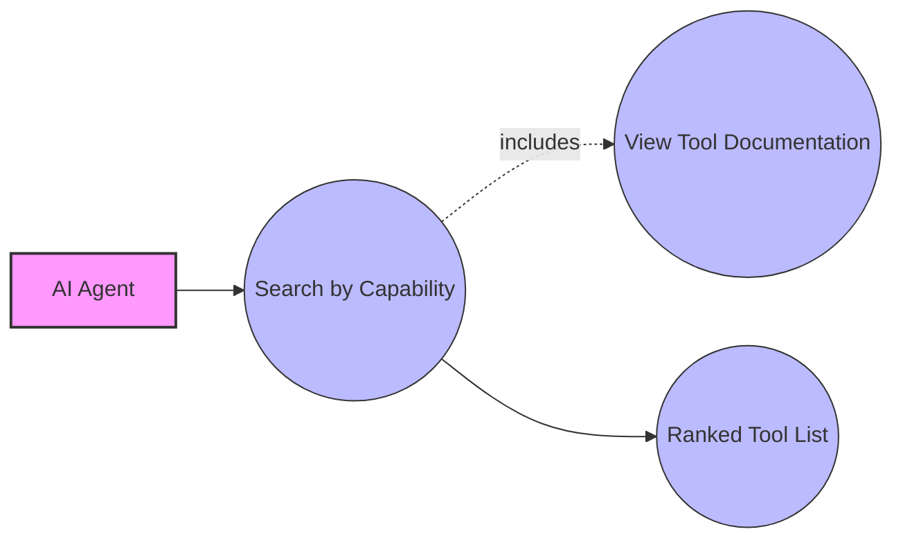

**Actor**: AI Agent  
**Goal**: Find tools that match specific functional requirements  
**Flow**:
1. Agent queries registry with capability description or functional requirements
2. Registry searches metadata across the network for matching tools
3. Registry returns ranked list of tools that might fulfill the requirements
4. Agent selects and invokes the most appropriate tool

## 🧑‍💻 Tool Provider Use Cases

### UC-P1: Tool Registration

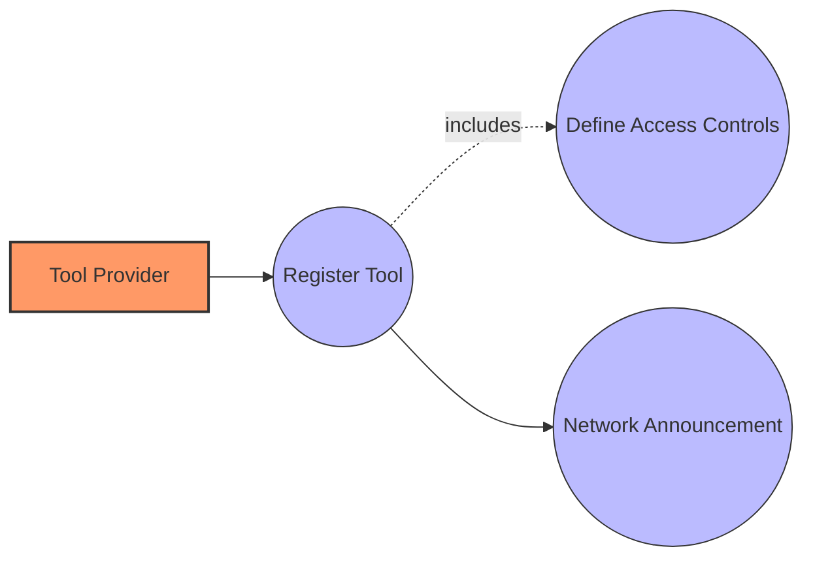

**Actor**: Tool Provider  
**Goal**: Make a tool available to the network  
**Flow**:
1. Provider implements tool according to MCP specifications
2. Provider generates metadata including capabilities, requirements, and access controls
3. Provider registers tool with their local registry node
4. Registry validates tool interface and metadata
5. Registry makes tool available locally and announces to connected nodes
6. Tool becomes discoverable by agents across the network

### UC-P2: Tool Update

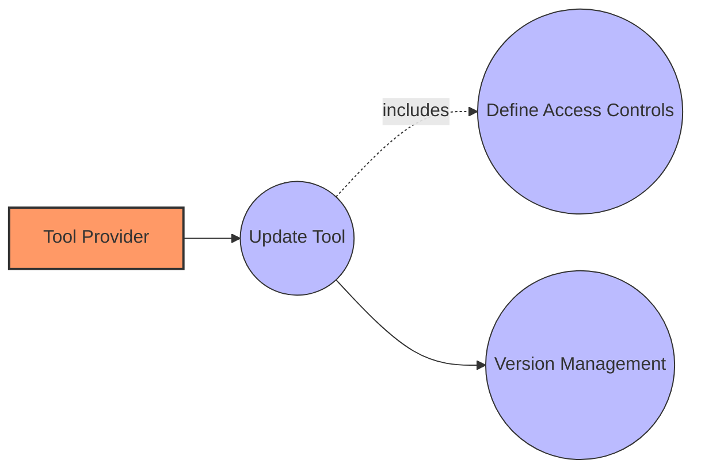

**Actor**: Tool Provider  
**Goal**: Deploy a new version of an existing tool  
**Flow**:
1. Provider implements changes to the tool
2. Provider updates version information and changelog
3. Provider registers the new version with the registry
4. Registry maintains both old and new versions
5. Registry propagates version information to connected nodes
6. Agents can discover and use either version according to compatibility needs

### UC-P3: Define Billing Terms

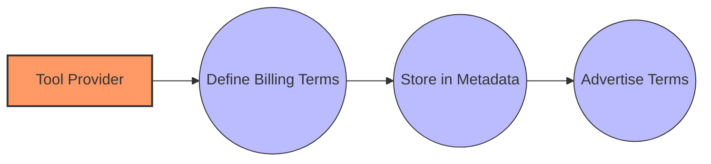

**Actor**: Tool Provider  
**Goal**: Establish payment structure for tool usage  
**Flow**:
1. Provider defines pricing model (per-call, subscription, etc.)
2. Provider sets rates and conditions
3. Provider configures billing information in the registry
4. Registry stores billing configuration with tool metadata
5. Registry includes billing terms when advertising the tool
6. Agents/users can review terms before tool usage

## 👤 Operator Use Cases

### UC-O1: Network Joining

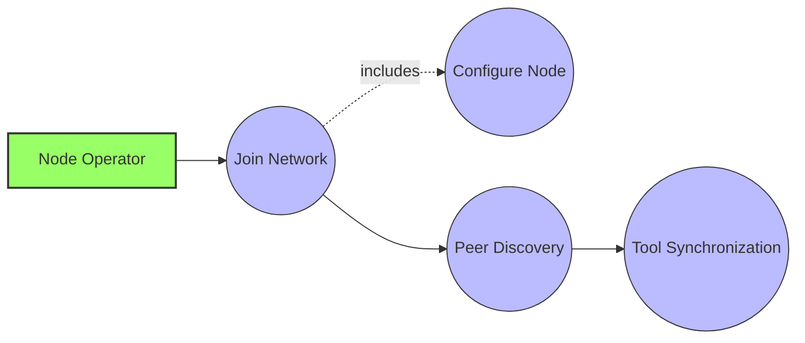

**Actor**: Node Operator  
**Goal**: Connect a new node to the P2P network  
**Flow**:
1. Operator installs the registry software
2. Operator configures basic node identity and network settings
3. Operator provides connection information for at least one existing node
4. Registry node connects to the network entry point
5. Registry node discovers additional peers through DHT mechanisms
6. Registry node begins synchronizing tool metadata with connected peers
7. Node becomes a fully functional part of the network

### UC-O2: Local Tool Installation

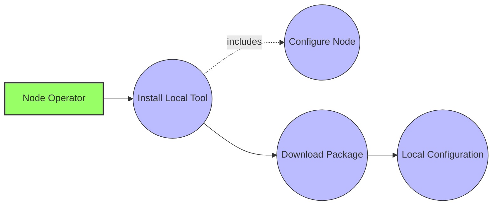

**Actor**: Node Operator  
**Goal**: Install tool for local execution  
**Flow**:
1. Operator discovers tool through registry interface
2. Operator initiates local installation process
3. Registry validates tool authenticity and checks dependencies
4. Registry downloads tool package and dependencies
5. Registry installs tool in local environment
6. Registry configures tool for local execution
7. Tool becomes available for direct invocation without network relaying

### UC-O3: Access Control Configuration

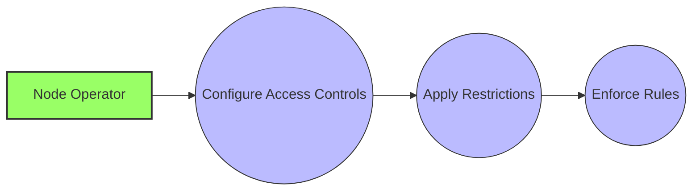

**Actor**: Node Operator  
**Goal**: Restrict access to specific tools  
**Flow**:
1. Operator reviews available tools on their node
2. Operator selects tools to restrict
3. Operator configures access rules (whitelist, authentication requirements, etc.)
4. Registry applies restrictions to tool metadata
5. Registry enforces access rules on incoming invocation requests
6. Only authorized agents/users can access restricted tools

## 💼 Financial Use Cases

### UC-F1: Transaction Recording

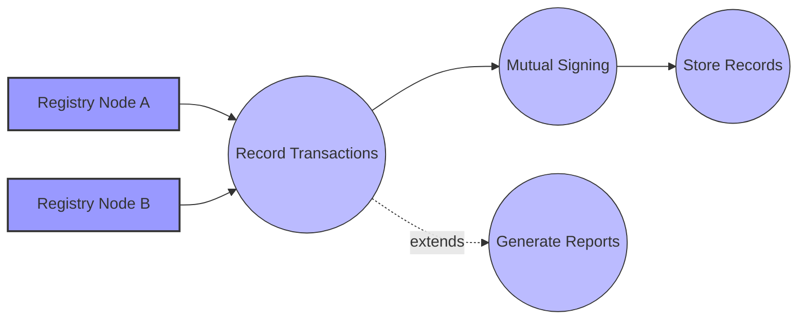

**Actor**: Registry Nodes  
**Goal**: Track billable tool usage  
**Flow**:
1. Agent invokes a tool with associated billing
2. Provider registry node records the transaction with timestamp and details
3. Consumer registry node also records the transaction
4. Both nodes cryptographically sign the transaction record
5. Both nodes store the mutually signed record in their respective ledgers

### UC-F2: Billing Reconciliation

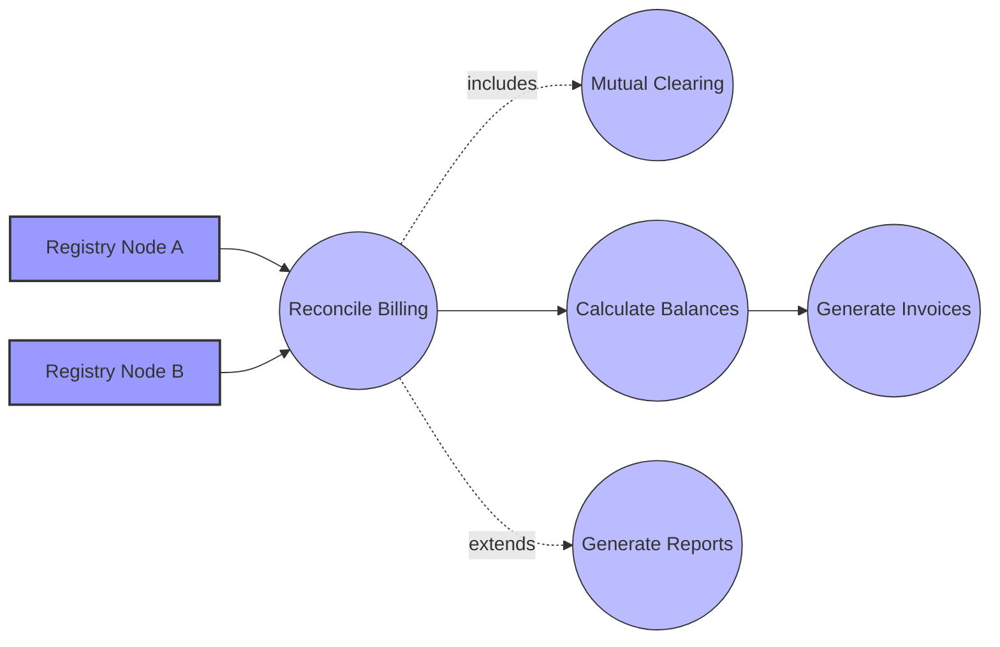

**Actor**: Registry Nodes  
**Goal**: Settle accumulated transaction records  
**Flow**:
1. Registry nodes initiate reconciliation on scheduled basis
2. Nodes exchange and validate their transaction records
3. Nodes identify and resolve any discrepancies
4. Nodes calculate net amounts owed based on validated records
5. Nodes identify circular debt patterns among connected parties
6. Nodes optimize debt through mutual clearing where possible
7. Nodes generate formal invoices for remaining balances

## 🔧 Administrative Use Cases

### UC-A1: Network Monitoring

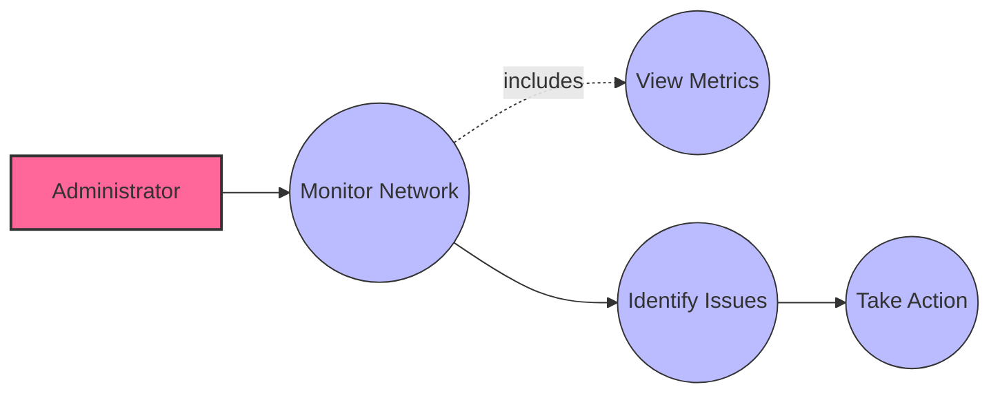

**Actor**: Administrator  
**Goal**: Assess health and activity of the registry network  
**Flow**:
1. Administrator accesses monitoring interface
2. System collects metrics from local registry and connected nodes
3. System displays node connectivity, tool availability, and usage patterns
4. Administrator can identify issues or bottlenecks
5. Administrator can take corrective action if needed

### UC-A2: Tool Reputation Management

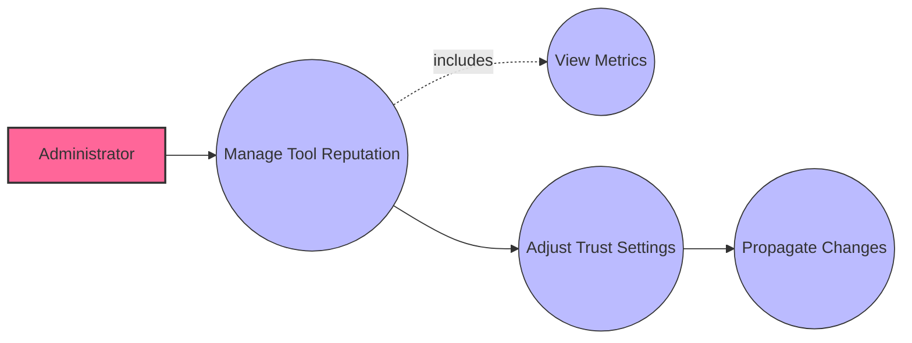

**Actor**: Administrator  
**Goal**: Review and manage tool trust levels  
**Flow**:
1. Administrator reviews reputation metrics for tools
2. System displays usage statistics, reliability scores, and user feedback
3. Administrator can adjust trust settings for specific tools
4. Administrator can block problematic tools
5. Trust changes propagate to connected nodes according to trust model

### UC-A3: Configure Security Policies

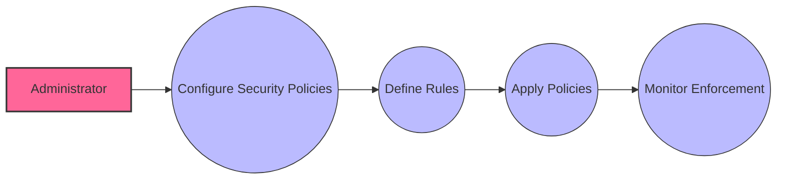

**Actor**: Administrator  
**Goal**: Establish security parameters for the registry node  
**Flow**:
1. Administrator accesses security configuration interface
2. Administrator defines authentication requirements
3. Administrator configures trust thresholds and policies
4. Administrator sets access control defaults
5. System applies security policies to all registry operations
6. Administrator monitors security policy enforcement

## 🔒 Security Use Cases

### UC-S1: Node Verification

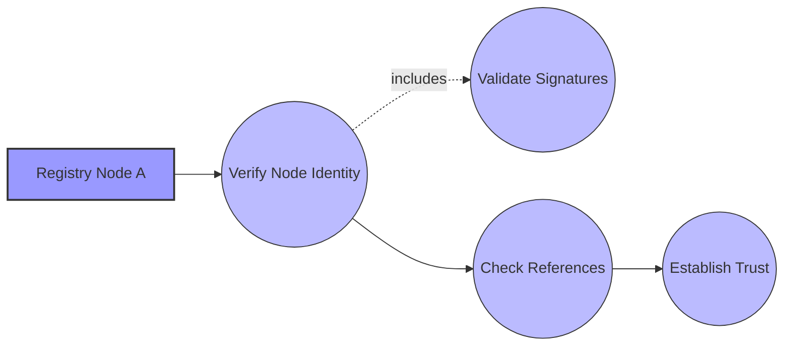

**Actor**: Registry Node  
**Goal**: Verify identity and trustworthiness of another node  
**Flow**:
1. Node receives connection request from another node
2. Node requests cryptographic proof of identity
3. Node checks trust references from already-trusted nodes
4. Node validates reputation score if available
5. Node grants appropriate trust level based on verification results
6. Node establishes secure communication channel for future interactions

### UC-S2: Manage Trust Levels

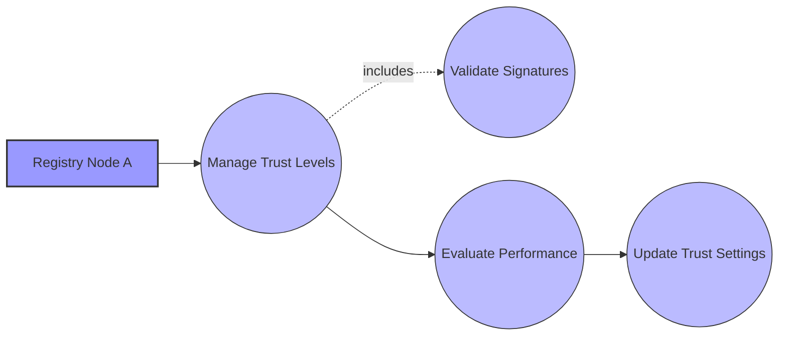

**Actor**: Registry Node  
**Goal**: Maintain and adjust trust relationships with other nodes  
**Flow**:
1. Node monitors interaction history with other nodes
2. Node evaluates reliability and behavior patterns
3. Node adjusts trust levels based on observed performance
4. Node shares trust assessments with other trusted nodes
5. Node applies community feedback to trust calculations
6. Trust changes affect routing, access, and transaction privileges